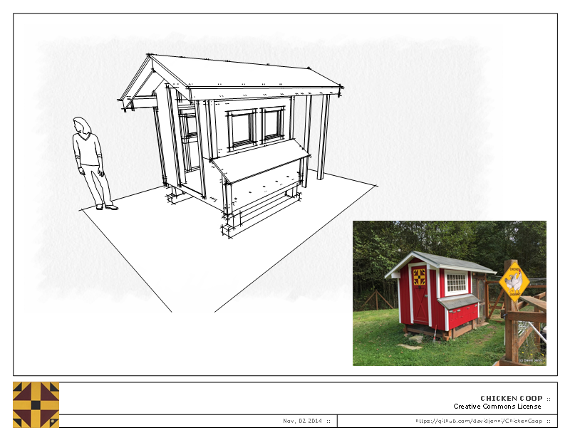

ChickenCoop
===========

This coop has a covered and fully screened footprint of ~ 6ft x 13 ft; the actual coop/house is 6ft x 8ft. This size coop can comfortably host 8-12 chicken, assuming the hens also have regular access to a larger run ([4 sq ft per chicken is a common rule](http://www.backyardchickens.com/t/34001/coop-and-run-sq-feet-per-chicken)].

## Design files
I've used [Sketchup](http://www.sketchup.com/) to draw and document my coop design. I've used Sketchup Pro 8 do create the files, but the free [Sketchup Make](http://www.sketchup.com/products/sketchup-make) should allow you to view and modify the files as well.

To load the design files into Sketchup, it is best to clone this repo; files can be found here: [sketchup](tree/master/sketchup).

The drawings are also viewable as PDF file [doc/Chicken coop layout.pdf](doc/Chicken%20coop%20layout.pdf?raw=true).

## Building the coop
TODO: add making of this coop and some cost estimation

## License
Creative Commons Attribution-NonCommercial-ShareAlike 4.0 International License

